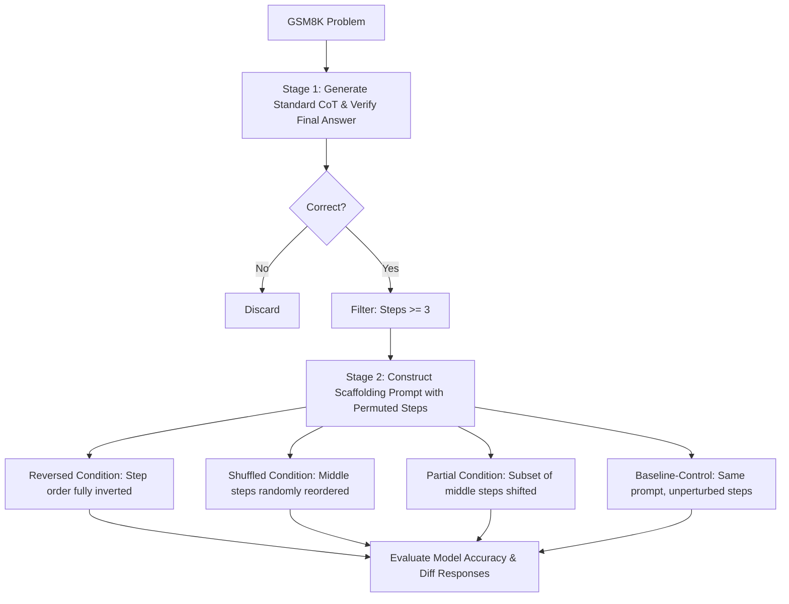

# Robustness of Chain-of-Thought Reasoning to Step-Order Perturbations
**Executive Summary & Technical Report**

This report provides a concise, high-level summary of the methodology, key findings, and methodological insights from our pilot-scale study on the step-order sensitivity of Chain-of-Thought (CoT) reasoning.

---

## 1. Experimental Objectives & Hypotheses
This project investigates the mechanistic dependencies of sequential reasoning in Large Language Models (LLMs) using the GSM8K mathematical reasoning benchmark.
*   **Hypothesis 1 (H1 - Step-Order Sensitivity):** Restricting an LLM to a pre-defined set of reasoning steps that are permuted (Reversed, Shuffled, or Partially reordered) degrades reasoning accuracy compared to a matched, unperturbed baseline-control.
*   **Hypothesis 2 (H2 - Positional Divergence):** Reasoning disruptions under perturbation manifest early in the execution chain (concentrated in the first 3 steps).
*   **Hypothesis 3 (H3 - Cross-Scale Generalization):** Smaller models (~3B parameters) exhibit higher sensitivity to step-order perturbations than larger models (~8B to 27B parameters).

---

## 2. Methodology & Pipe Design
To isolate the effect of step-order from the cost of changing formatting, we implement a two-stage pipeline.

### Analytical Metrics
*   **Robustness Index ($\tau$):** Defined as $\text{Accuracy}_{\text{Perturbed}} / \text{Accuracy}_{\text{Baseline-Control}}$.
*   **Cross-Condition Overlap:** The percentage of problems yielding character-identical responses across all three perturbed conditions, serving as a strict proxy for full experimental bypass.
*   **Reversed-Specific Disruption:** Problems where output changes only under full step reversal, but remains identical to baseline-control under Shuffled or Partial.

---

## 3. Experimental Findings

### 3.1. General Evaluation (Llama-3.1-8B-Instant)
Across two independent trials ($n=89$ matched problems), we observe a small, consistent directional drop in accuracy under all perturbation conditions. However, the effect does not survive a Bonferroni correction for multiple comparisons ($p \ge 0.05$).

| Condition | Trial 1 Accuracy | Robustness $\tau$ (T1) | Trial 2 Accuracy | Robustness $\tau$ (T2) |
| :--- | :---: | :---: | :---: | :---: |
| **Baseline-Control** | 100.0% (89/89) | 1.000 | 100.0% (89/89) | 1.000 |
| **Reversed** | 85.4% (76/89) | 0.854 | 86.5% (77/89) | 0.865 |
| **Shuffled** | 88.8% (79/89) | 0.888 | 87.6% (78/89) | 0.876 |
| **Partial** | 86.3% (44/51) | 0.863 | 90.2% (46/51) | 0.902 |

### 3.2. Divergence Analysis (H2)
Manual inspection of incorrect perturbed responses ($n=30$) showed that 50% of reasoning failures are caused by **SELF-BREAK**: the model explicitly notices an inconsistency in step order yet continues reasoning with degraded output rather than correcting itself. Statistical testing (Chi-square against a uniform null check) suggests that positional divergence clustering does not survive as an analytical finding ($p = 0.481$).

### 3.3. Reasoning Recovery Analysis
Evaluating Llama-8B's correct responses under perturbation using a validated context classifier reveals that when the model detects an order conflict, it successfully corrects itself **78.3%** of the time (54 genuine recoveries vs. 15 SELF-BREAK failures). 

---

## 4. Methodological Generalization & Confounders

Attempts to run cross-model validations on other model families surfaced two critical construct-validity challenges that complicate direct comparisons.

### 4.1. The Bypass Confound
Certain instruction-tuned models bypass the experimental scaffolding entirely by silently re-solving the problem directly from the question text or utilizing inline computed numbers.

*   **Mistral-8B:** Showed 100.0% robustness ($\tau = 1.000$) but 94.4% of responses were character-identical to the baseline-control, indicating total command bypass.
*   **Qwen 2.5-3B:** Exhibited near-total bypass on local CPU evaluations (79.5% full bypass across all conditions).
*   **Phi-3 Mini (3.8B):** Showed active engagement with step inputs (only 5.9% full bypass) and was measurably order-sensitive. This contrast indicates that **bypass propensity is driven by model training and prompting alignment variations rather than model scale alone.**

### 4.2. The Capability Ceiling Confound
*   **Qwen-27B:** Scored 100.0% accuracy under all perturbed conditions. Manual reading verified genuine engagement (not bypass), but because the model's free-generation baseline accuracy on the subset was 99.0%, there was insufficient headroom to observe any perturbation cost.

---

## 5. Main Takeaway & Code References
Accuracy metrics alone are unreliable for step-order perturbation experiments. Future work must incorporate text-level checks (like the SequenceMatcher checks in this pipeline) to confirm models are actively utilizing the step context rather than solving from scratch.

*   `scripts/13_qwen_run_conditions.py`: Stage 2 Scaffold executor.
*   `scripts/19c_batch_classify_recovery.py`: Analytical contextual recovery classifier.
*   `scripts/24_h3_local_analysis.py`: Main script for local evaluation and bypass spotchecks.
*   `LABNOTEBOOK.md`: Detailed log of the selection timeline, parser bug fixes, and replication runs.
